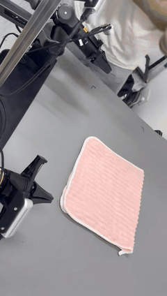
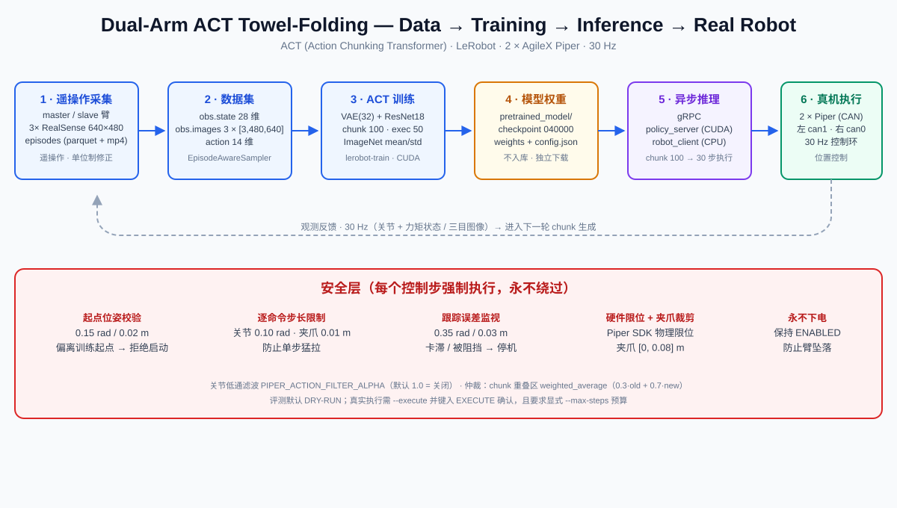

<div align="center">

# 双臂 ACT 叠毛巾（Dual-Arm ACT Towel Folding）

**基于真实双 AgileX Piper 机械臂的模仿学习项目：柔性物体（毛巾）双臂协同操作完整闭环。**

ACT（Action Chunking Transformer）· LeRobot · gRPC 异步推理 · 30 Hz 实时控制 · 完整安全层

**English version**: [README.md](README.md)

</div>

---

## 这个项目展示什么

一套跑在**两台真实机械臂**上的叠毛巾技能，端到端闭环：

| 维度 | 说明 |
|---|---|
| 模仿学习与 ACT | CVAE + Transformer，预测整段动作块 |
| 双臂协同 | 单个 14 维动作向量同时驱动双臂与双夹爪 |
| 柔性物体操作 | 折叠可形变毛巾，不是刚性抓取 |
| 完整闭环 | 遥操作采集 → 数据集 → 训练 → gRPC 异步部署 → 30 Hz 真机控制 |
| 实时控制与安全 | 每个动作下发前经纯 numpy 安全层校验；默认 dry-run |
| 定量评测与失败分析 | 报告口径「10/10 consecutive trials」，不编造成功率 |
| 工程化与可复现 | 可运行脚本、可单测安全码、配置契约测试、结果模板须真实回填 |

> 🎬 Hero 演示 —— 连续十次录像中的第 1 次试验：



---

## 结果卡片：10/10 consecutive trials

> 在一次连续录制的实验中，系统完成 10 次测试并成功 10 次（10/10 consecutive trials）。

| 项 | 值 |
|---|---|
| 录制 | 单次连续拍摄，无内部剪辑 |
| 试验区间 | 1.5 – 314.0 s（约 34 秒/次） |
| 完成 / 成功 | 10 / 10 |
| 人工复位 | 是 —— 每次试验前由操作员重新摆放毛巾 |
| 时间精度 | ±0.5 s |
| Checkpoint | 040000 |
| 分阶段表现 | 每次试验的 approach / 左右抓取 / 抬升 / 折叠 / 释放均可见且成功 |

逐次时间戳与阶段标志：`results/consecutive_10_trials.csv` · 逐帧审阅全文：`results/consecutive_10_trials_review.md`

---

## 系统架构



```
遥操作采集 → LeRobot 数据集 → ACT 训练 → 权重检查点
        → gRPC policy_server（CUDA）→ robot_client（CPU）→ 双 Piper（CAN）
        → 30 Hz 观测反馈 → 生成下一 chunk
```

安全层**每个控制步强制执行**：起点位姿校验（0.15 rad / 0.02 m）、逐命令步长限制（0.10 rad / 0.01 m）、跟踪误差（0.35 rad / 0.03 m）、硬件限位、夹爪裁剪到 [0, 0.08] m，以及**永不下发 disable 指令**（机械臂保持 ENABLED 以防坠落）。

---

## 关键参数（读取自真实运行，非猜测）

| 维度 | 值 |
|---|---|
| 观测 `observation.state` | 28（双臂 × 7 电机 × 位置+力矩） |
| 动作 | 14 = [左 j1..j6, 左夹爪, 右 j1..j6, 右夹爪]，位置控制 |
| 相机 | 三目 640×480 @ 30 fps |
| ACT 分块 | chunk 100 · 训练执行 50 · 部署执行 30 |
| 异步推理 | gRPC，`weighted_average`（0.3·old + 0.7·new），`chunk_size_threshold=0.6` |
| 控制环 | 30 Hz |
| 检查点 | `pretrained_model/`（部署使用 global step 040000） |

> ⚠️ 任何未经审计日志确认的项一律标注 **待确认**，不编造数据。

---

## 仓库结构

```
assets/   架构图（+ Hero GIF 占位）
configs/  训练 / 评测 / 机器人示例配置
docs/     架构 · 数据采集 · 训练 · 部署 · 安全系统 · 评测 · 复现 · 工程化 · 路线图
results/  仅回填模板（evaluation_summary.json / trial_results.csv /
          latency_results.csv / consecutive_10_trials.csv）
scripts/  训练 · 评测 · 部署 · dry-run · 环境检查
src/      safety.py（纯 numpy 校验器）· reset_pose · eval_rollout · piper 驱动
tests/    安全行为 / 动作形状 / 配置契约 / checkpoint 加载
```

## 快速开始

```bash
pip install -e ".[dev]"

./scripts/check_environment.sh     # 依赖 / CUDA / CAN / 相机 / checkpoint
./scripts/dry_run.sh               # 全流程 dry-run，不动作
python -m pytest tests/ -q         # 安全层 + 配置单测
```

真实执行**永远不是默认**：需要 `--execute` + 键入 `EXECUTE` + 显式 `--max-steps` 预算。详见 `docs/inference-deployment.md` 与 `docs/safety-system.md`。

## 下载（数据与权重——不入库）

- **数据集**（LeRobot episodes）：由采集主机导出，见 `docs/reproducibility.md`。
- **检查点**（`pretrained_model/`）：由训练主机导出，设置 `POLICY_CHECKPOINT`。
- **视频**：仓库只放 GIF / 封面 / 链接，原始素材保留在本机。

## 操作红线（逐字保留）

1. 原始 ACT 项目只能读取，不能直接修改。
2. 必须创建一个新的、独立的 GitHub 发布目录。
3. 不允许覆盖原始训练配置、推理代码、模型或数据。
4. 不允许修改正在使用的 ACT checkpoint。
5. 不允许未经确认连接或控制机械臂。
6. 不允许未经确认执行 CAN 命令。
7. 不允许未经确认向 GitHub 推送。
8. 所有修改先保存在新的发布目录中，完成审查后再由我决定是否上传。

## 致谢与许可

- LeRobot / ACTPolicy — Apache 2.0，基于 Tony Z. Zhao 的 ALOHA 工作。见 `NOTICE` 与 `CITATION.cff`。
- AgileX Piper SDK — 按其自身许可（见 `NOTICE`）。
- 本仓库以 Apache 2.0 发布（`LICENSE`）。

**待确认审计项**与诚实边界记录在 `docs/evaluation.md` 与 `docs/roadmap.md`。
